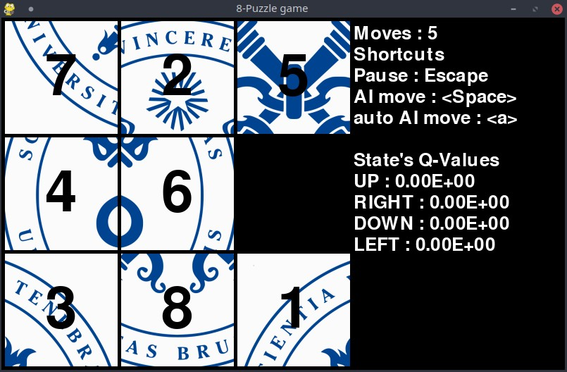

# Le Taquin (The 8 Puzzle)
Vous trouverez ci-dessous les instructions et détails sur le jeu du 8 Puzzle (ou Taquin).
Le principe du jeu est simple, réussir à retrouver l'image originale en déplaçant la seule pièce
libre à chaque tour de jeu.

Ce jeu est ici présenté avec 2 AI différentes, une IA par apprentissage par renforcement et
une recherche par A\*.

## Installation
Pour installer le jeu, commencez par copier le dépot du livre ([AI-book sur github][ia-gh]),
soit en récupérant l'archive zip depuis github, soit à l'aide de l'outil git:
```
git clone https://github.com/iridia-ulb/AI-book
```

Puis, accedez au dossier du jeu:

```bash
cd 8Puzzle
```

Après avoir installé python et poetry, rendez-vous dans ce dossier et installez les
dépendances du projet:

```bash
poetry install
```

## Utilisation

Vous pouvez ensuite lancer le jeu dans l'environnement virtuel nouvellement créé.
Le jeu en mode "recherche A\*" se lance comme ceci:

```bash
poetry run python main.py -a
```

Le jeu en mode apprentissage par renforcement (Reinforcement Learning et plus spécifiquement 
Q learning) se lance comme ceci:
```bash
poetry run python main.py -r
```
Ensuite suivez les instructions à l'écran.

En résumé:

```bash
usage: main.py [-h] [-a] [-r]

8Puzzle game.

optional arguments:
  -h, --help   show this help message and exit
  -a, --astar  Start the program in A* mode.
  -r, --rl     Start the program in RL mode.
```

## Notes

Pour l'apprentissage par renforcement (Q learning) les "tables Q" (càd les IA déjà entrainées)
sont stockées dans le dossier `QTable` dans des fichiers texte (`QTable_#.txt`)
Un exemple d'IA dèjà entrainée est disponible dans le fichier `QTable_0.txt`



[ia-gh]: https://github.com/iridia-ulb/AI-book
