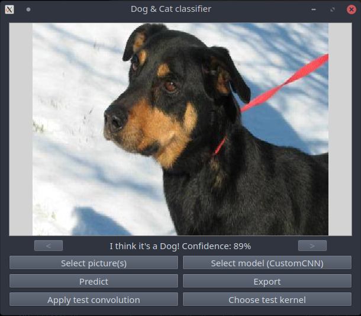

# Chien ou chat ?

Vous trouverez ci-dessous les instructions et détails sur le programme
"Chien ou chat?". Le but de se programme est de réussir à déterminer 
si une image contient un chien ou un chat.

Ce programme utilise le deep learning et notamment les réseaux de neurones
convolutionels (CNN), grace à la librairie tensorflow/keras.

## Installation
Ce projet utilise la librairie tensorflow et peut nécéssiter un GPU (une carte
graphique dédiée) pour fonctionner correctement.

Pour installer l'application, commencez par copier le dépot du livre ([AI-book sur github][ia-gh]),
soit en recupérant l'archive zip depuis github, soit à l'aide de l'outil git:
```
git clone https://github.com/iridia-ulb/AI-book
```

Puis, accedez au dossier:

```bash
cd Cat_or_Dog
```

Après avoir installé python et poetry, rendez vous dans ce dossier et installez les
dépendances du projet:

```bash
poetry install
```

## Utilisation

Vous pouvez ensuite lancer le jeu, dans l'environnement virtuel nouvellement
créé, en utilisant la commande:

```bash
poetry run python main.py
```



Une fois lancé, vous pouvez charger un réseau de neurone pré-entrainé en cliquant
sur "Select model".
Une fois le modèle selectionné vous pouvez charger une image (jpg uniquement)
en cliquant sur "Select picture(s)", puis "Predict" pour voir la prédiction 
du réseau de neurone s'afficher.

Il est aussi possible de tester certains filtres sur une image cliquant sur
"Choose test kernel", puis en choisissant un filtre à appliquer à l'image,
puis finalement cliquer sur "Apply test convolution".

### Entrainement

Pour en entrainer un nouveau réseau de neurone, vous pouvez utiliser le
programme `train.py`, utilisable comme ceci:

```bash
poetry run python train.py -f customCNN
```
Dans cette exemple, à la fin de l'entrainement,
le modèle sera enregistré dans le dossier `model_customCNN`.

Chaque modèle enregistré dans le dossier principal du projet 
sera ensuite selectionable dans l'interface de `main.py`

En résumé:

```bash
usage: train.py [-h] [-f FOLDER]

CNN Trainer for the Cat or Dog app.

optional arguments:
  -h, --help            show this help message and exit
  -f FOLDER, --folder FOLDER
                        Destination folder to save the model after training ends.
```

[ia-gh]: https://github.com/iridia-ulb/AI-book
