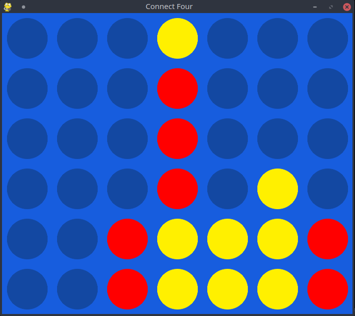

# Puissance 4 (Connect 4)

Vous trouverez ci-dessous les instructions et détails sur le jeu du puissance 4.
Le but du jeu étant d'aligner 4 jetons de la même couleur dans une grille bidimensionnelle.
Chaque joueur mettant une pièce par tour.

Le jeu est présenté ici avec deux techniques d'IA, une recherche avec l'algorithme minimax
et une recherche d'abre monté carlo (Monte Carlo Tree Search, MCTS).

## Installation
Pour installer le jeu, commencez par copier le dépot du livre ([AI-book sur github][ia-gh]),
soit en recupérant l'archive zip depuis github, soit à l'aide de l'outil git:
```
git clone https://github.com/iridia-ulb/AI-book
```

Puis, accedez au dossier du jeu:

```bash
cd Connect4
```

Après avoir installé python et poetry, rendez vous dans ce dossier et installez les
dépendances du projet:

```bash
poetry install
```

## Utilisation

Vous pouvez ensuite lancer le jeu dans l'environnement virtuel nouvellement créé.
Lors du lancement du jeu, il vous faudra choisir quels algorithmes sont vous
affronter, ou s'affronter entre eux, par exemple:

```bash
poetry run python main.py --p1 minimax --p2 mcts
```

démarre une partie IA minimax contre IA Monte Carlo.

Il est possible de jouer contre une IA en adaptant la commande comme ceci:

```bash
poetry run python main.py --p1 human --p2 mcts
```

Il suffit alors de cliquer à l'endroit ou vous voulez jouer lors de votre tour.

Les options `--p1` et `--p2` peuvent prendre en argument minimax, mcts, random
ou human pour la première et minimax, mcts ou random pour la deuxième.

En résumé
```
usage: main.py [-h] --player1 {minimax,mcts,random,human} --player2 {minimax,mcts,random}

The Connect 4 game

optional arguments:
  -h, --help            show this help message and exit
  --player1 {minimax,mcts,random,human}, --p1 {minimax,mcts,random,human}, -1 {minimax,mcts,random,human}
                        Type of player for player 1
  --player2 {minimax,mcts,random}, --p2 {minimax,mcts,random}, -2 {minimax,mcts,random}
                        Type of player for player 2

```



[ia-gh]: https://github.com/iridia-ulb/AI-book
