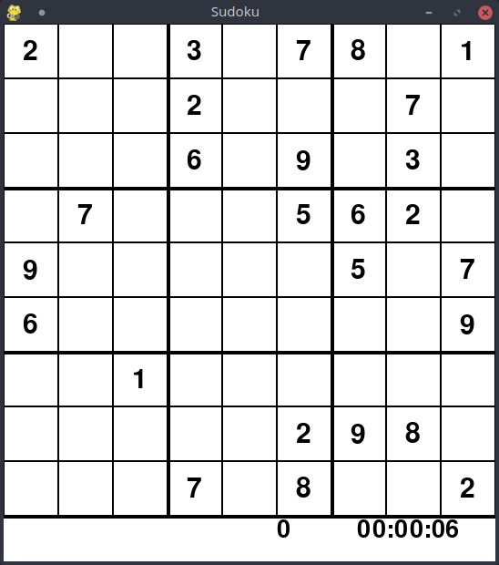

# Sudoku

Vous trouverez ci-dessous les instructions et détails sur le jeu du sudoku.
Le but du jeu étant de remplir la grille du sudoku avec les chiffres 1 à 9
chacun présent une et une seule fois dans chaque ligne, colonne et bloc.

Le jeu est présenté avec deux AI différentes, l'une avec une recherche classique
et l'autre avec un algorithme génétique.


## Installation

Pour installer l'application, commencez par copier le dépot du livre ([AI-book sur github][ia-gh]),
soit en recupérant l'archive zip depuis github, soit à l'aide de l'outil git:
```
git clone https://github.com/iridia-ulb/AI-book
```

Puis, accedez au dossier:

```bash
cd Sudoku
```

Après avoir installé python et poetry, rendez vous dans ce dossier et installez les
dépendances du projet:

```bash
poetry install
```

## Utilisation

Vous pouvez ensuite lancer le jeu dans l'environnement virtuel nouvellement créé.
Le jeu en mode recherche se lance comme ceci:
```bash
poetry run python main.py -f sudokus/sudoku1.txt -a search
```
### Sélection de l'algorithme
Pour selection l'algorithme à utiliser dans le jeu, changez l'option `-a`
dans la ligne de commande.
Cette option peut prendre 2 valeurs, `search` pour l'algorithme de recherche
ou `genetic` pour l'algorithme génétique.

Une fois lancé, vous pouvez jouer vous même avec la grille en entrant les chiffres
en utilisant à votre clavier et votre souris; ou alors *lancer l'IA* en appuyant sur 
la *barre espace*.

En résumé:
```
usage: main.py [-h] [-a {search,genetic}] [-f FILE]

Launch the sudoku game

optional arguments:
  -h, --help            show this help message and exit
  -a {search,genetic}, --algorithm {search,genetic}
                        Choose the algorithm to execute
  -f FILE, --file FILE  Sudoky instance to solve
```


### Grille personnalisée
Dans cette ligne de commande, l'option `-f`, represente l'instance du sudoku à résoudre,
par defaut, on utilise une instance contenue dans le  fichier `sudokus/sudoku1.txt`.
Vous trouverez d'autres instances à tester dans le fichier `sudokus/sudokus.txt`.

Les fichiers doivent être formatés tels que la grille du sudoku à remplir est constituée
d'une serie de chiffre sur une ligne, en lisant la grille de gauche à droite et de haut
en bas, et en remplaçant les espaces libres par des 0.

Par exemple, le fichier contenant:
```
200307801000200070000609030070005620900000507600000009001000000000002980000708002
```
représente la grille suivante:



[ia-gh]: https://github.com/iridia-ulb/AI-book


