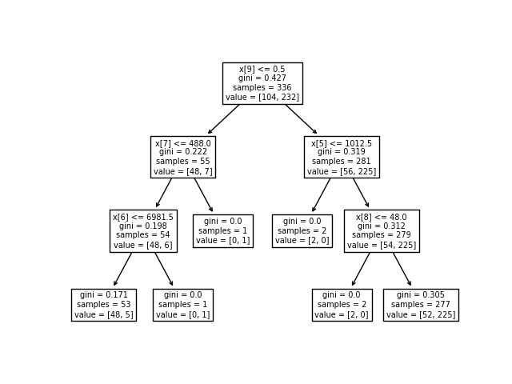

# Arbre de décision (decision trees)

Vous trouverez ci-dessous les instructions et détails sur l'application
permettant de tester les arbres de décisions sur un jeu de donnée fourni.

L'application fournie un exemple pour créer et entrainer un arbre de décision
ou une forêt d'arbres décisionnels à l'aide d'une bibliothèque ou non.
La première partie de l'application implémente l'algorithme de création
et d'entrainement depuis zéro, et la deuxième partie présente l'utilisation
de la bibliothèque `sklearn`.

## Installation

Pour installer l'application, commencez par copier le dépot du livre ([AI-book sur github][ia-gh]),
soit en recupérant l'archive zip depuis github, soit à l'aide de l'outil git:

```
git clone https://github.com/iridia-ulb/AI-book
```

Puis, accedez au dossier :

```bash
cd DecisionTrees
```

Après avoir installé python et poetry, rendez vous dans ce dossier et installez les
dépendances du projet :

```bash
poetry install
```

## Utilisation

Lancez le programme avec la commande suivante:

```bash
poetry run python main.py
```

Le programme commencera par afficher la matrice de corélation entre les
différentes variables, puis entrainera, 3 modèles: 2 arbres de décision
et une fôret aléatoire, pour finalement imprimer la précision comparée
des 3 modèles.



[ia-gh]: https://github.com/iridia-ulb/AI-book


